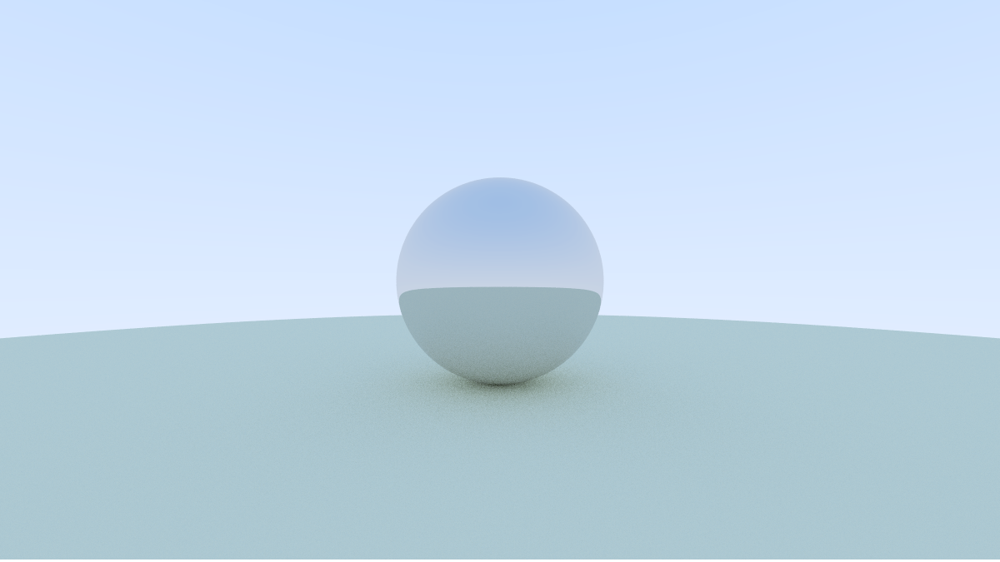

# GoRays

GoRays is a simple ray tracer written in Go.
It is based on the book "Ray Tracing in One Weekend" by Peter Shirley.



## Basic usage

```bash
go run ./cli.go render --help

Basic way of using the raytracer. Specify a scene file and the raytracer will generate an image.
If no scene file is specified, the raytracer will use the default scene file.
A PNG file will be generated in the root directory of the project.

Usage:
  raytracer render [flags]

Flags:
  -h, --help            help for render
  -o, --output string   Path to the output file (default "output.png")
  -s, --scene string    Path to the scene file (default "scenes/demo.json")
```

## Getting Started

To run the ray tracer with a basic preconfigured scene simply run the following command:

```bash
make demo
```

This will generate a file called `output.png` in the root directory of the project.


To specify a scene file (in JSON or YAML format) use the `--scene` flag:


```bash
make scene="scenes/demo.json" render

# or run directly

go run ./cli.go render --scene scenes/demo.json
```

## Building for WASM

To build the ray tracer for the web run the following command:

```bash
make wasm
```

This will generate a wasm binary inside the dist folder.
